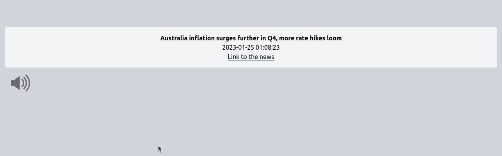

# webscrapping-reuters-with-websocket
Aplicação desenvolvida para o Teste Técnico da Axia Futures. 

Webscrapping com Puppetteer  
WebSockets usando Socket.io  
Database utilizada foi um postgres rodando em um Container.

Também foi incluído um sistema de notificações por som, se o usuário desejar ser notificado a cada mudança que acontece. A aplicação está consumindo a notícia mais recente do feed de notícias do https://reuters.com/markets/currencies.

## Como usar a aplicação localmente:

Precisaremos de 2 terminais para rodar a aplicação.

### 1 Conectando database e instalando pacotes

- 1.1  git clone git@github.com:adrielldev/webscrapping-reuters-with-websocket.git  
- 1.2  cd webscrapping-reuters-with-websocket/  
- 1.3  npm i  
- 1.4  docker-compose up -d

###  2 Iniciando Serrvidor com Websocket

- 2.1  node ./server/index.js

### 3 Acessando
- 3.0 Vá para http://localhost:3000

## Uma imagem da aplicação 

